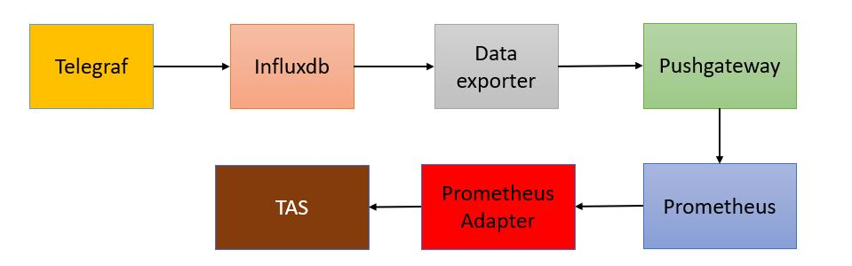
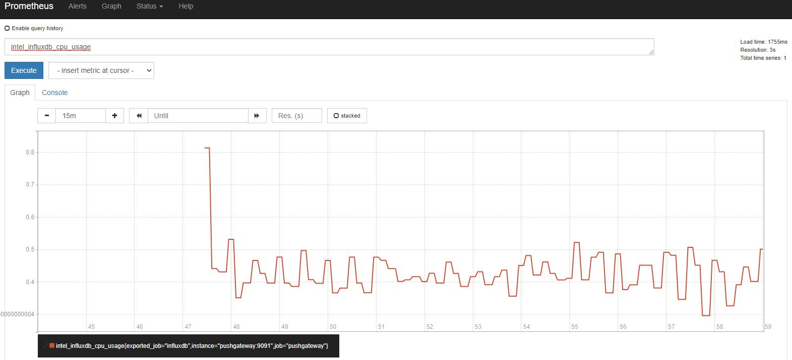

# poc-influxdata-to-prometheus



## Steps:
1. K8s was installed on the system.
2. This POC's TICK Helm Chart refers to https://github.com/influxdata/helm-charts. Only Telegraf and Influxdb required.

   - For Influxdb2: 
     
     To install it on control node, please update the toleration and affinity in influxdb2/values.yaml.
     ```commandline
     tolerations:
       - effect: NoSchedule
         key: node-role.kubernetes.io/master
         operator: Exists
   
     affinity:
       nodeAffinity:
         requiredDuringSchedulingIgnoredDuringExecution:
           nodeSelectorTerms:
             - matchExpressions:
                 - key: node-role.kubernetes.io/master
                   operator: Exists
     ```
     In this POC, persistence volume was disabled. Service and credentials details as follows:
     ```
     persistence:
       enabled: false
     ```
     ```
     service:
       type: NodePort
       port: 8086
       targetPort: 8086
       annotations: {}
       labels: {}
       portName: http
     ```
     ```
     adminUser:
       organization: "influxdata"
       bucket: "default"
       user: "admin"
       retention_policy: "0s"
       ## Leave empty to generate a random password and token.
       ## Or fill any of these values to use fixed values.
       password: "admin12345"
       token: "admin12345"

     ```
   - For Telegraf: 
     
     Please generate and get the token from Influxdb2. The config outputs in telegraf/values.yaml as follows:
     ```
       outputs:
         - influxdb_v2:
             urls:
               - "http://influxdb2:8086/"
             bucket: "telegraf"
             token: "M5xiSwf9-A8edY1Y8z1H9i-9Pl0_uJ81wn87o4wu6ah8A-b8R9hAamBHJ0Qhd0D-7UZJquVbhAp5m8UTfaPC7g=="
             organization: "influxdata"
     ``` 

3. Prometheus was installed on the system and it is exposed to default namespace. You can refer to [TAS CUSTOM METRICS](https://github.com/intel/platform-aware-scheduling/blob/master/telemetry-aware-scheduling/docs/custom-metrics.md) for Prometheus deployment. Please change the namespace to default namespace.
Add pushgateway to _prometheus_helm_chart/templates/prometheus-config-map.yaml_ before helm install. 
```
       - job_name: 'pushgateway'
        honor_labels: false
        static_configs:
        - targets: ['pushgateway:9091']
        kubernetes_sd_configs:
        - role: node
        relabel_configs:
        - source_labels: [__address__]
          regex: ^(.*):\d+$
          target_label: __address__
          replacement: $1:9091
```


4. Deploy Pushgateway. 
`sudo kubectl apply -f pushgateway.yaml`
5. Deploy data-exporter.
`sudo kubectl apply -f data-exporter.yaml`

6. Login to Prometheus server and check the data.


7. TAS needs Prometheus Adapter in order to function. You can also refer to [TAS CUSTOM METRICS](https://github.com/intel/platform-aware-scheduling/blob/master/telemetry-aware-scheduling/docs/custom-metrics.md) for the Prometheus Adapter's deployment. Since the Prometheus's namespace is default, we have to update the prometheus-url in _prometheus_custom_metrics_helm_chart/templates/custom-metrics-apiserver-deployment.yaml_ to default namespace.

> --prometheus-url=http://prom-service.default.svc:9090/


Other than that, the [Prometheus Adapter's config map](https://github.com/intel/platform-aware-scheduling/blob/master/telemetry-aware-scheduling/deploy/charts/prometheus_custom_metrics_helm_chart/templates/custom-metrics-config-map.yaml) have to update by adding the name of the exposed metrics.

```
    - seriesQuery: '{__name__=~"^intel_.*"}'
      resources:
        overrides:
          instance:
            resource: node
      name:
        matches: ^intel_(.*)
      metricsQuery: <<.Series>>

```


8. After deployed the Prometheus Adapter, run the kubectl command below to check the cpu_usage data exposed to Prometheus Adapter (Custom Metrics). 

`sudo kubectl get --raw /apis/custom.metrics.k8s.io/v1beta1 | grep nodes | jq . | grep node | grep -i influx`

Expected Output:
>       "name": "nodes/influxdb_cpu_usage",

## Build data-exporter image
sudo docker build \
     --build-arg HTTP_PROXY=${HTTP_PROXY:-} \
     --build-arg http_proxy=${http_proxy:-} \
     --build-arg HTTPS_PROXY=${HTTPS_PROXY:-} \
     --build-arg https_proxy=${https_proxy:-} \
     --build-arg NO_PROXY=${NO_PROXY:-} \
     --build-arg no_proxy=${no_proxy:-} \
     -t data-exporter -f Dockerfile .
